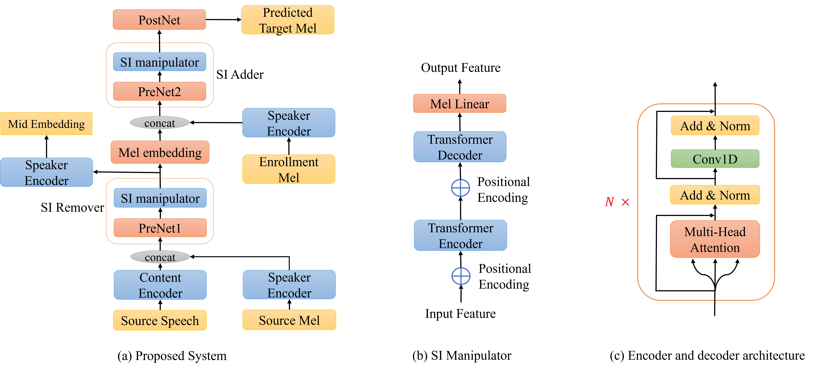

# SIG-VC
This repo is the official implementation of the paper "SIG-VC: A Speaker Information Guided Zero-Shot Voice Conversion System for Both Human Beings and Machines"   

<p align="center"></p>

> [**SIG-VC: A Speaker Information Guided Zero-Shot Voice Conversion System for Both Human Beings and Machines**](https://arxiv.org/abs/2111.03811)
>
> Haozhe Zhang, Zexin Cai, Xiaoyi Qin, Ming Li

### Abstract

Nowadays, as more and more systems achieve good performance in traditional voice conversion (VC) tasks, people’s attention gradually turns to VC tasks under extreme conditions. In this paper, we propose a novel method for zero-shot voice conversion. We aim to obtain intermediate representations for speaker-content disentanglement of speech to better remove speaker information and get pure content information. Accordingly, our proposed framework contains a module that removes the speaker information from the acoustic feature of the source speaker. Moreover, speaker information control is added to our system to maintain the voice cloning performance.
The proposed system is evaluated by subjective and objective metrics. Results show that our proposed system significantly reduces the trade-off problem in zero-shot voice conversion, while it also manages to have high spoofing power to the speaker verification system.

Following the steps below to reimplement the model or train on your own custom dataset.
## 1. Download Pre-trained Models
Download the pre-trained bottleneck feature extractor and put it under bn_extractor/acoustic_mdl/  
https://drive.google.com/file/d/1U9tXNMdvISjQNl8iXMouoirPEaOi68tX/view?usp=drive_link

Download the pre-trained speaker embedding extractor and put it under conversion/sv_model/save_model/ECAPA-TDNN/  
https://drive.google.com/file/d/1ywV4ErX5ocN4jC8Q4xluELQxXvATDeVt/view?usp=drive_link

Download the pre-trained voice converesion model and put it under conversion/aishell_twostage/ckpt/  
https://drive.google.com/file/d/16Gx-vE8kwbtXaCPEgidAifT74crjwEGA/view?usp=drive_link

## 2. Environment Setup
### compile and install kaldi
Resources that might help:  
    kaldi build up: https://www.kaldi-asr.org/doc/build_setup.html  
    Cygwin: https://groups.google.com/g/kaldi-help/c/C2tcoAsP9Uo  
```
#Bash

#download kaldi
git clone https://github.com/kaldi-asr/kaldi.git kaldi --origin upstreamcd
kaldi

#compile kaldi
#go to 'tools' directory under the kaldi repository
cd tools
#check whether the system dependencies are installed, if not, install them according to the prompts
./extras/check_dependencies.sh

#install kaldi
#go to 'src' directory under the kaldi repository
cd src

#run the following command (they are also in the INSTALL file)
./configure --shared
make depend -j 8
make -j 8
```
n.b. Remember to edit the KALDI_HOME variable in bn_extractor/path.sh to point to the kaldi repository on your machine

### Install Anaconda Virtual Environment
```
#Bash
conda env create -f pytorch.yaml
```
Now you have a anaconda virtual environment named "pytorch", to enter this virtual environment, run:
```
#Bash
conda activate pytorch
```

## 3. Data Preparation
### Prepare the training and testing files
All the training data should be put under the path conversion/training_data/
All the test data should be put under the path conversion/test_data/
For inference, please copy the wav files of source speaker under the path conversion/test_data/source, and copy the wav files of the target speaker under the path conversion/test_data/target/
The inference code with generate converted speech for each source-target pair.
Please refer to the following example structure:
```
conversion/training_data/
    t1.wav
    t2.wav
conversion/test_data/
    t3.wav
    t4.wav
    /source/
        t3.wav
    /target/
        t4.wav
#the following directory will be automatically generated by the provided code
conversion/bnf
conversion/mel
conversion/emb
```

### Extract Bottleneck Features
Under the path <root>/conversion/ (<root> is where you put this repository)
```
#Bash
bash extract_bnf.sh training_data bnf
bash extract_bnf.sh test_data bnf
```

### Extract Mel-spectrogram
```
#Bash
#extract mel-spectrogram of training data
python mel.py --mode train

#extract mel-spectrogram of test data
python mel.py --mode test
```

### Extract speaker embeddings
```
#Bash
python embed_extraction.py
```

## 4.Train the model
### Finetune from the pre-trained model (pre-trained on AISHELL-3)
```
#Bash
CUDA_VISIBLE_DEVICES=<n> python train.py --restore_step 201000
```

### Train from scratch
```
#Bash
CUDA_VISIBLE_DEVICES=<n> python train.py
```

## 5.Inference
Run the following commands, the converted speech will be under the path conversion/syn_wav/
```
#Bash
#372000 is the step when the model converges, you can refer to aishell_twostage/ckpt/ to find the converging step 
CUDA_VISIBLE_DEVICES=<n> python test.py --test_step 372000

#convert the generated mel-spectrogram to wav
python melgan-80-fast/synthesis.py ./syn_mel ./syn_wav
```
